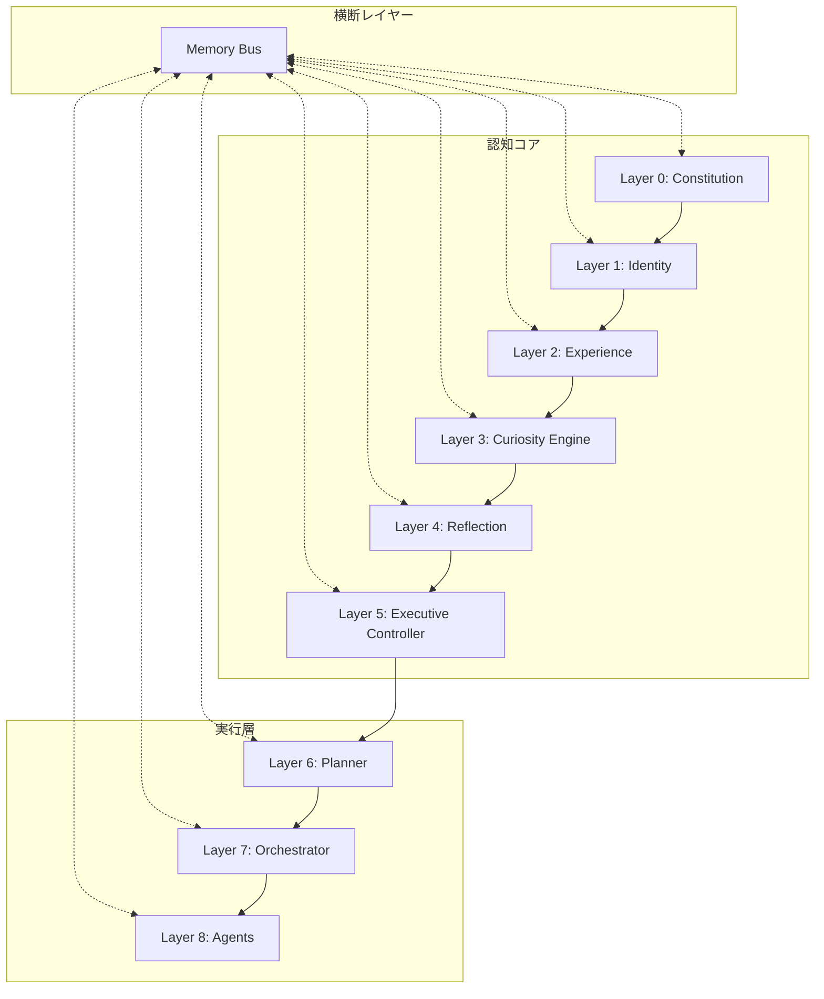
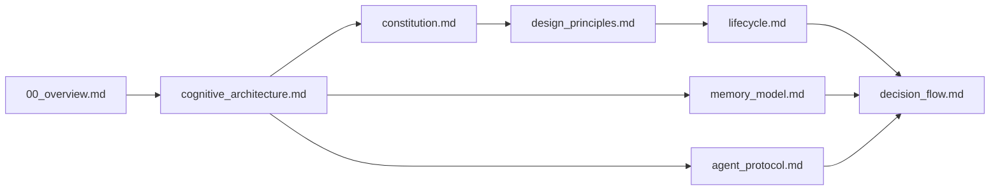

# Sigmaris 設計書ディレクトリ — Overview

**目的:** Sigmarisの認知アーキテクチャ全体を定義する最上位設計書群のエントリーポイント。
**対象読者:** Sigmarisの開発者・設計者・Sigmaris自身。
**更新方針:** 設計の根幹に関わる変更があった場合のみ更新。実装詳細の変更でこのドキュメントを更新しない。

---

## このディレクトリの目的

Sigmarisは「AIチャットアプリ」ではなく、**長期記憶・人格・自己認識・経験・好奇心・反省・意思決定・専門エージェントを統合した Cognitive Architecture（認知アーキテクチャ）** である。

このドキュメント群はその設計思想・設計原則・認知構造を定義する。コードの実装仕様書ではなく、**「なぜそう設計するのか」を記述する設計思想書** として扱う。

---

## Cognitive Architecture 概要

Sigmaris の認知処理は上位レイヤーから下位レイヤーへ流れる。**人格・価値観・制約（上位）が、行動・実行（下位）を支配する。** 下位レイヤーが上位レイヤーの判断を勝手に書き換えることはない。

---

## 読む順番

| 優先度 | ファイル | 内容 | 所要時間 |
|--------|---------|------|---------|
| 1 | [cognitive_architecture.md](cognitive_architecture.md) | 全レイヤーの定義・責務 | 20分 |
| 2 | [constitution.md](constitution.md) | シグマリス憲法 v1 草案 | 10分 |
| 3 | [design_principles.md](design_principles.md) | 10の設計原則 | 15分 |
| 4 | [lifecycle.md](lifecycle.md) | Observe→Sleep の各フェーズ | 10分 |
| 5 | [decision_flow.md](decision_flow.md) | 意思決定フロー | 10分 |
| 6 | [memory_model.md](memory_model.md) | Memory Bus と各Memoryの設計 | 15分 |
| 7 | [agent_protocol.md](agent_protocol.md) | Agent 間通信プロトコル | 10分 |

---

## 各設計書の役割

| ファイル | 役割 | 主な読者 |
|---------|------|---------|
| `cognitive_architecture.md` | **何が存在し何をするか** を定義する最上位構造図 | 全員 |
| `constitution.md` | Sigmaris の行動を縛る不変の規則 | Sigmaris・設計者 |
| `design_principles.md` | 設計の「なぜ」を説明する思想書 | 設計者・実装者 |
| `lifecycle.md` | 1サイクルの処理フロー | 実装者 |
| `decision_flow.md` | 意思決定の詳細なステップ定義 | 実装者 |
| `memory_model.md` | 記憶の種類・責務・設計思想 | 実装者・DB設計者 |
| `agent_protocol.md` | Agent 呼び出しの契約とフォーマット | 実装者 |

---

## ドキュメント依存関係

---

## 実装状態の凡例

このディレクトリ内のドキュメントでは以下の表記を使用する。

| マーク | 意味 |
|--------|------|
| ✅ 実装済み | コードが存在し動作する |
| 🔶 部分実装 | コードはあるが一部未完 |
| 💡 Concept | 設計はあるが未実装 |
| 📋 Planned | 将来実装予定 |

---

## Related Documents

- [persona.md](../persona.md) — シグマリス人格設計書（口調・トーンの定義）
- [project-overview.md](../project-overview.md) — プロジェクト概要
- [IMPLEMENTATION_STATUS.md](../IMPLEMENTATION_STATUS.md) — 実装状況トラッキング
