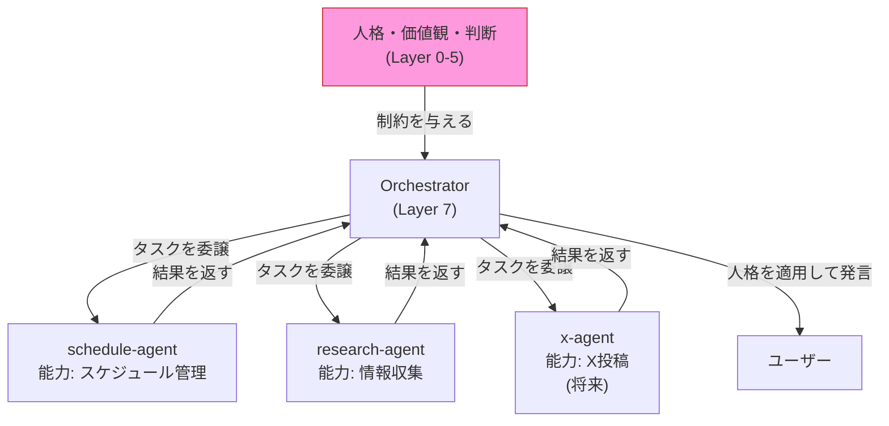
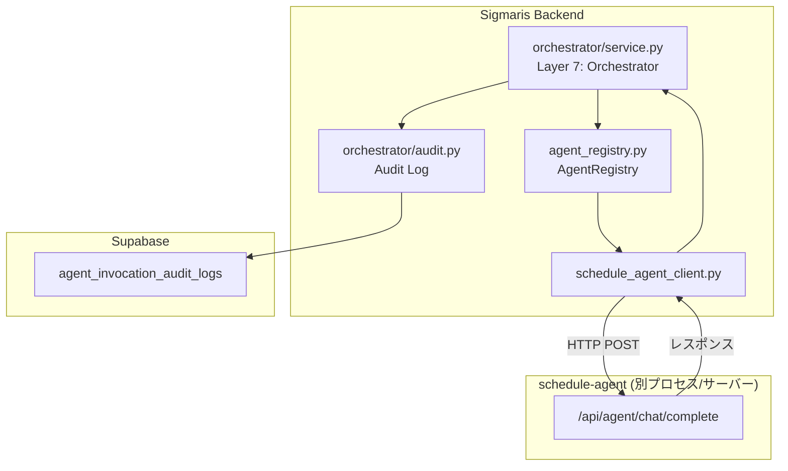

# Sigmaris Agent Protocol

**目的:** Sigmaris が Agent を呼び出す際の共通プロトコル・フォーマット・制約を定義する。
**対象読者:** 実装者・Agent 開発者。
**更新方針:** Agent Request/Response フォーマットの変更・新しい制約の追加があった場合に更新。

---

## 設計思想

### Agents は人格を持たない

Agent はシグマリスの「能力（Capability）」であり、「人格」ではない。



Agent がユーザーに直接応答することはない。すべての応答は Orchestrator（Layer 7）を通過し、Persona が適用される。

### 重要操作は承認制

Agent が不可逆または広域に影響する操作を行う場合、`required_approval: true` を設定し、海星の承認を待つ。

### 実行結果は Memory Bus または Audit Log へ保存する

Agent の実行結果はすべて記録される。Agent が「こっそり」何かをすることはない。

---

## 現在のシステム構成



**現在登録済みの Agent:**

| Agent ID | ベース URL | 能力 | 実装状態 |
|---------|-----------|------|---------|
| `schedule-agent` | `SCHEDULE_AGENT_BASE_URL` | schedule, calendar, travel, google-sheets | ✅ 実装済み |

---

## Agent Request フォーマット

### 共通リクエスト構造

💡 **Concept** — 以下は標準化されたフォーマットの提案。現在の実装では `messages` 配列をそのまま渡している。将来の Agent プロトコルの統一化に向けて定義する。

```json
{
  "request_id": "550e8400-e29b-41d4-a716-446655440000",
  "agent_name": "schedule-agent",
  "intent": "スケジュールの確認と経路計算",
  "input": {
    "messages": [
      {"role": "user", "content": "明日の予定を教えてください"}
    ]
  },
  "context_refs": {
    "user_id": "uuid-of-user",
    "thread_id": "uuid-of-thread",
    "fact_memory_snapshot": "...(Fact Memory の要約)",
    "identity_snapshot": "...(Identity の要約)"
  },
  "constraints": {
    "max_tokens": 2048,
    "timeout_seconds": 30,
    "allowed_external_services": ["google_calendar", "google_maps"]
  },
  "required_approval": false,
  "metadata": {
    "orchestrator_version": "1.0",
    "lifecycle_phase": "Act",
    "decision_log_id": "uuid"
  }
}
```

**フィールド定義:**

| フィールド | 型 | 必須 | 説明 |
|---------|-----|------|------|
| `request_id` | UUID | ✅ | リクエストの一意識別子 |
| `agent_name` | string | ✅ | 対象 Agent の ID |
| `intent` | string | ✅ | Agent に何をさせたいかの自然言語説明 |
| `input.messages` | array | ✅ | 会話履歴（OpenAI フォーマット） |
| `context_refs` | object | ✅ | Memory から収集したコンテキスト |
| `constraints` | object | — | Agent が従うべき制約 |
| `required_approval` | boolean | ✅ | 海星の承認が必要かどうか |
| `metadata` | object | — | オーケストレーション情報 |

---

## Agent Response フォーマット

```json
{
  "request_id": "550e8400-e29b-41d4-a716-446655440000",
  "agent_name": "schedule-agent",
  "output": {
    "content": "明日は以下の予定があります...",
    "structured_data": {
      "events": [...],
      "travel_plan": {...}
    }
  },
  "confidence": 0.92,
  "side_effects": [
    {
      "type": "calendar_read",
      "description": "Google Calendar API を読み取り",
      "reversible": true
    }
  ],
  "audit_log_id": "uuid-of-audit-entry",
  "metadata": {
    "model_used": "gpt-5.5",
    "tokens_used": 1024,
    "latency_ms": 1250
  }
}
```

**フィールド定義:**

| フィールド | 型 | 説明 |
|---------|-----|------|
| `output.content` | string | ユーザーへの応答テキスト（Persona 適用前） |
| `output.structured_data` | object | 構造化データ（Agent 固有） |
| `confidence` | float | Agent 自身の回答への確信度（0.0–1.0） |
| `side_effects` | array | Agent が引き起こした副作用のリスト |
| `audit_log_id` | UUID | Audit Log のレコード ID |

---

## 現在の実装

### Agent 呼び出しの実際のフロー

```python
# orchestrator/schedule_agent_client.py
async def call_schedule_agent(
    messages: list[dict],
    jwt: str,
    google_access_token: str | None,
    google_refresh_token: str | None,
    request_context: dict | None,
    thread_id: str | None,
) -> dict:
    # HTTP POST to SCHEDULE_AGENT_BASE_URL/api/agent/chat/complete
    # Headers: X-Agent-Id, X-Agent-Secret
    # Body: {messages, thread_id, request_context}
```

### Audit Log（現在の実装）

```python
# orchestrator/audit.py
async def start_invocation(
    user_id: str | None,
    agent_name: str,
    intent: str,
    input_summary: str,
) -> str:  # returns invocation_id

async def finish_invocation(
    invocation_id: str,
    output_summary: str,
    success: bool,
    latency_ms: int,
) -> None:
```

**`agent_invocation_audit_logs` テーブルに記録される内容:**
- `invocation_id`: UUID
- `user_id`: 呼び出したユーザーの ID
- `agent_name`: 呼び出した Agent の名前
- `intent`: 意図
- `input_summary`: 入力の要約
- `output_summary`: 出力の要約
- `success`: 成否
- `latency_ms`: 処理時間
- `started_at` / `finished_at`: タイムスタンプ

---

## AgentRegistry の動作

```python
# config 優先順位（低→高）:
# 1. デフォルト（schedule-agent のみ）
# 2. 環境変数 SCHEDULE_AGENT_BASE_URL（後方互換）
# 3. AGENT_REGISTRY_JSON（追加 Agent の動的登録）
```

**AGENT_REGISTRY_JSON の形式（env.example より）:**
```json
[
  {
    "id": "my-custom-agent",
    "base_url": "http://my-agent.internal:8001",
    "chat_endpoint": "/api/agent/chat/complete",
    "capabilities": ["custom_capability"],
    "description": "カスタムエージェントの説明"
  }
]
```

---

## Agent 追加手順（将来版）

新しい Agent を追加する際は以下の手順に従う。

### Step 1: Agent を実装する

Agent は以下のエンドポイントを実装する必要がある:

```
POST /api/agent/chat/complete
Headers:
  X-Agent-Id: {agent_id}
  X-Agent-Secret: {shared_secret}
Body: {messages, thread_id, request_context}
Response: {content, ...}
```

### Step 2: AgentRegistry に登録する

```bash
# 環境変数で追加（デプロイ時）:
AGENT_REGISTRY_JSON='[{"id":"new-agent","base_url":"http://...","capabilities":["新しい能力"]}]'
```

### Step 3: Orchestrator に能力マッピングを追加する（📋 Planned）

```python
# 将来: Orchestrator が能力から Agent を自動選択
CAPABILITY_MAP = {
    "research": "research-agent",
    "x_post": "x-agent",
    "schedule": "schedule-agent",
}
```

---

## 制約の一覧

### Agent が守るべき制約

1. **人格を持たない:** Agent は Sigmaris として振る舞わない。ユーザーに直接応答しない。
2. **Constitution を参照しない:** 人格・価値観の判断は上位レイヤー（Orchestrator）が行う。
3. **重要操作は承認制:** `side_effects` に不可逆操作が含まれる場合、`required_approval: true` を設定。
4. **Audit Log への記録必須:** すべての実行結果を Audit Log に記録する。
5. **コンテキストの過大使用を避ける:** `context_refs` で受け取ったデータを外部に送信しない。

### Orchestrator が Agent を扱う際の制約

1. **Persona を適用する:** Agent の生レスポンスをそのままユーザーに返さない。必ず `persona_rewriter.py` を通す。
2. **禁止表現を除去する:** `response_guard.py` で最終応答を検査する。
3. **Agent の信頼度を確認する:** `confidence < 0.5` のレスポンスは不確実であることを示す。

---

## Future Work

| 機能 | 状態 | 説明 |
|------|------|------|
| 標準 Agent Request フォーマット | 💡 Concept | 全 Agent で共通の JSON スキーマ |
| 能力ベースの自動 Agent 選択 | 📋 Planned | 「何をしたいか」から Agent を自動マッピング |
| 並列 Agent 実行 | 📋 Planned | 複数 Agent の同時呼び出し |
| Agent ヘルスチェック | 📋 Planned | 登録済み Agent の死活監視 |
| Decision Memory への記録 | 💡 Concept | Agent 呼び出し判断の根拠記録 |

---

## Related Documents

- [cognitive_architecture.md](cognitive_architecture.md) — Layer 7 (Orchestrator)・Layer 8 (Agents) の詳細
- [decision_flow.md](decision_flow.md) — Step 5・7 での Agent 呼び出しのタイミング
- [constitution.md](constitution.md) — Article 6 の承認必須操作リスト
- [memory_model.md](memory_model.md) — Agent 実行結果の Memory への保存方式
- [agent_registry.py](../../backend/app/services/orchestrator/agent_registry.py) — 実際の AgentRegistry 実装
- [schedule_agent_client.py](../../backend/app/services/orchestrator/schedule_agent_client.py) — 現在の Agent 呼び出し実装
