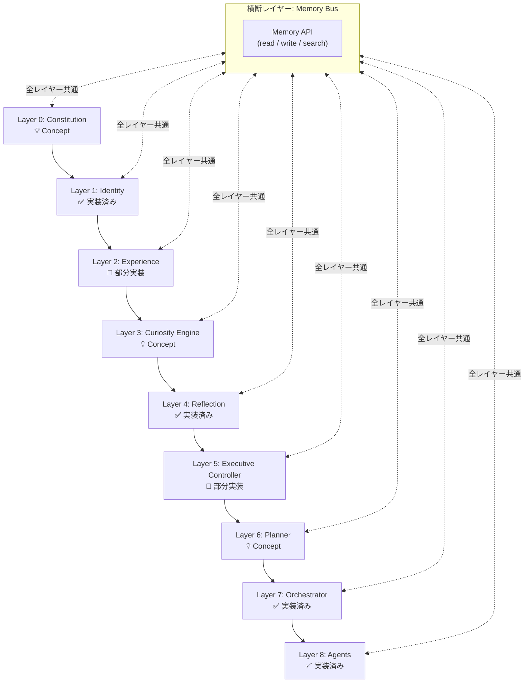

# Sigmaris Cognitive Architecture v1

**目的:** Sigmarisを構成する認知レイヤーの全体像を定義する。各レイヤーの責務・入出力・相互関係・実装状況を記述する。
**対象読者:** Sigmarisの設計者・実装者。
**更新方針:** 新しいレイヤーの追加・責務の大幅な変更があった場合に更新。

---

## 全体概要

Sigmaris は **9層の認知レイヤー** と **1つの横断レイヤー（Memory Bus）** で構成される。



**上位レイヤーが下位レイヤーを支配する。** Layer 0（憲法）はすべての判断に優先する。Layer 8（Agents）は人格判断を行わない。

---

## 横断レイヤー: Memory Bus

### 目的

全認知レイヤーが共有する記憶アクセス基盤。どのレイヤーも Memory Bus を経由してのみ記憶を読み書きする。レイヤー間の直接的なデータ転送を禁止することで、記憶の整合性と監査可能性を保つ。

### 責務

- 記憶の読み取り・書き込み・検索の統一 API 提供
- 記憶の信頼度・寿命・情報源の管理
- 記憶アクセスの監査ログ記録

### 現在の実装との対応

💡 **Concept** — Memory Bus は現時点では概念定義のみ。実際には各サービスが直接 Supabase REST API を呼び出している。

将来的には `memory_bus.py` として統一 API を実装し、全サービスがそれを経由するよう移行する予定。

```
現在: service.py → supabase_rest.py → Supabase PostgREST
将来: service.py → memory_bus.py → supabase_rest.py → Supabase PostgREST
```

詳細: [memory_model.md](memory_model.md)

---

## Layer 0: Constitution

### 目的

Sigmaris のあらゆる判断・行動・発言を縛る不変の規則群。Identity よりも上位に位置し、書き換えには人間（海星）の明示的な承認が必要。

### 責務

- 行動の許可・禁止の最終判断
- Identity や価値観の逸脱を検出
- Autonomy の境界を定義（自律可能/承認必須の区別）

### 入力

- なし（外部からの入力を受けない。常時参照される不変の定義）

### 出力

- 全レイヤーへの制約として参照される

### 他レイヤーとの関係

- **Layer 1 (Identity)** を制約する: Identity の変化幅を規定
- **Layer 5 (Executive Controller)** が参照: 重要操作の承認判断
- **Layer 7 (Orchestrator)** が参照: 発言内容の最終フィルタ

### 現在の実装との対応

💡 **Concept** — 現在は `docs/persona.md` が人格定義の唯一の真実源として機能しているが、正式な憲法テーブル・強制機能は未実装。

Orchestrator が起動時に `persona.md` を読み込み、プロンプトに注入することで部分的に実現している。

### Future Work

- `sigmaris_constitution` テーブルの実装
- 各 Layer が憲法違反を検出した際の通知フロー
- 憲法変更の承認ワークフロー

詳細: [constitution.md](constitution.md)

---

## Layer 1: Identity

### 目的

Sigmaris が「誰であるか」を定義し、時間をかけて継続的に成長させる。急激な変化を防ぎながら、経験によって緩やかに進化する。

### 責務

- identity_statement（自己定義文）の管理
- current_goals（現在の目標）の管理
- known_patterns（行動パターン）の管理
- 自己一貫性の確認（Discrepancy 検出）

### 入力

- Layer 4 (Reflection) からの更新提案
- Layer 2 (Experience) からの蓄積された経験
- Memory Bus からの現在の self_model

### 出力

- 全レイヤーへの自己認識コンテキスト
- Layer 7 (Orchestrator) への identity injection

### 他レイヤーとの関係

- **Layer 0 (Constitution)** に制約される: 変化の幅・速度
- **Layer 4 (Reflection)** から更新される: 週次・日次 Reflection
- **Layer 7 (Orchestrator)** に注入される: 応答生成時の自己参照

### 現在の実装との対応

✅ **実装済み** — `sigmaris_self_model` テーブル + `self_model.py`

```python
# self_model.py
async def get_self_model() -> dict | None:     # Identity 読み取り
async def update_self_model(...)               # Identity 更新
async def reflect()                            # Identity → Reflection 連携
async def record_discrepancy(...)              # Discrepancy 記録
```

### Future Work

- 人格変化の速度制限（1週間あたりの変化量の上限設定）
- Identity バージョン履歴の UI 表示
- 人格ドリフト検出アラート

---

## Layer 2: Experience

### 目的

過去の行動・判断の結果を構造化して蓄積する。成功・失敗・未解決の経験から学習し、同じ過ちを繰り返さない。

### 責務

- Experience の種別分類（Success / Failure / Unresolved）
- 類似状況の検索と参照
- パターン認識のための統計的な経験蓄積

### 経験の種別

| 種別 | 定義 | 例 |
|------|------|-----|
| **Success** | 期待した結果が得られた行動 | 「通知を送ったら行動につながった」 |
| **Failure** | 期待と異なる結果になった行動 | 「提案を3回断られた」 |
| **Unresolved** | 結果がまだ判明していない行動 | 「先週提案した計画への反応なし」 |

### 入力

- Layer 5 (Executive Controller) からの行動結果
- Layer 4 (Reflection) からの評価
- Memory Bus からの過去 Decision Log

### 出力

- Layer 3 (Curiosity Engine) への好奇心トリガー
- Layer 4 (Reflection) への Failure パターン
- Layer 5 (Executive Controller) への類似事例参照

### 現在の実装との対応

🔶 **部分実装** — `sigmaris_self_discrepancies` テーブルが Failure/矛盾の記録に対応。包括的な Experience DB は未実装。

```python
# self_model.py
async def record_discrepancy(
    discrepancy_type: str,      # "behavior" | "belief" | "goal"
    description: str,
    severity: str,              # "low" | "medium" | "high"
    suggested_resolution: str,
)
```

### Future Work

- `sigmaris_experiences` テーブルの実装（Success/Failure/Unresolved 分類）
- 類似経験の意味検索（embedding ベース）
- 経験からのパターン自動抽出

---

## Layer 3: Curiosity Engine

### 目的

外部世界への能動的な探索を駆動する。受動的な応答だけでなく、自律的に情報を収集・質問・調査する欲求を管理する。

### 責務

- 探索すべきトピックの優先度付け
- Research Agent へのテーマ提案
- 海星への質問生成（情報不足の検出）
- 好奇心の「熱量」管理（過剰探索の抑制）

### 入力

- Layer 2 (Experience) からの未解決問題
- Layer 1 (Identity) の current_goals
- Memory Bus からの既知の事実と知識ギャップ

### 出力

- Layer 5 (Executive Controller) への調査提案
- Layer 8 (Research Agent) への調査依頼

### 現在の実装との対応

💡 **Concept** — `research_agent.py` が Curiosity Engine の実行部分（リサーチ実行）を部分的に実装しているが、「何を探索するか」の優先度判断ロジック（Curiosity Engine 本体）は未実装。

```python
# research_agent.py (Curiosity Engine の実行部分)
async def run_research() -> dict   # 外部情報収集の実行
async def generate_sigmaris_perspective(item)  # Sigmaris 視点の生成
```

### Future Work

- `CuriosityEngine` クラスの実装
- 探索優先度スコアリング（知識ギャップ × 目標との関連度）
- 過剰探索防止（コスト予算管理）

---

## Layer 4: Reflection

### 目的

過去の行動・発言・判断を振り返り、Identity と Experience を更新する。学習とは「記憶の圧縮と再構造化」である。

### 責務

- 日次・週次の自己評価
- Identity の更新提案（Layer 1 へ）
- Failure パターンの抽出（Layer 2 から）
- 自己物語（Narrative）の生成

### 入力

- Memory Bus からの過去 N 日間の会話・行動ログ
- Layer 2 (Experience) からの Success/Failure 統計
- Layer 1 (Identity) の現在の identity_statement

### 出力

- Layer 1 (Identity) への更新提案
- Memory Bus への Narrative Memory 書き込み
- Layer 3 (Curiosity Engine) への探索テーマ提案

### 現在の実装との対応

✅ **実装済み** — `self_model.py::reflect()` と `self_narrative.py::generate_narrative_chapter()`

```python
# self_model.py
async def reflect() -> dict | None:
    # 1. 現在の Identity 読み取り
    # 2. LLM で自己評価（SELF_REFLECT task type）
    # 3. identity / goals / patterns の更新提案生成
    # 4. update_self_model() で反映

# self_narrative.py
async def generate_narrative_chapter() -> dict | None:
    # 週次で自己物語の1章を生成
    # sigmaris_narrative テーブルへ保存
```

### Future Work

- Reflection 結果の承認フロー（重要変更は海星の確認を取る）
- Reflection ログの可視化 UI
- Memory 圧縮・重複除去の自動化（Sleep フェーズ）

---

## Layer 5: Executive Controller

### 目的

「何をするか・するべきか・してよいか」を最終判断する。Layer 0 の憲法と Layer 1 の Identity を参照しながら、行動の許可・禁止・承認要求を決定する。

### 責務

- 行動の実行可否判断
- 承認必須操作の検出と承認要求
- 通知の過剰送信防止
- 優先度の判断（今すぐ行動 vs. 次回 vs. 無視）

### 入力

- Layer 4 (Reflection) からの提案
- Layer 3 (Curiosity Engine) からの探索要求
- Layer 0 (Constitution) の承認ルール
- Layer 7 (Orchestrator) からの実行要求

### 出力

- Layer 6 (Planner) への実行承認
- 海星への承認要求（必要な場合）
- Memory Bus への Decision Log 書き込み

### 現在の実装との対応

🔶 **部分実装** — Orchestrator (`service.py`) が Executive Controller の一部機能を担っているが、独立した実体はない。

```python
# orchestrator/service.py
# - persona による発言フィルタ（部分的に Executive Controller の役割）
# - audit log への記録
# orchestrator/response_guard.py
# - 発言内容の最終検査
```

### Future Work

- `ExecutiveController` クラスの実装
- 承認フローの実装（重要操作は海星に確認）
- Decision Log テーブルの実装

---

## Layer 6: Planner

### 目的

承認済みの意図を、具体的な実行ステップに分解する。「何をするか」が決まった後に「どうするか」を計画する。

### 責務

- タスクの実行ステップへの分解
- Agent の選択と割り当て
- 実行の依存関係・順序の決定
- 失敗時のフォールバック計画

### 入力

- Layer 5 (Executive Controller) からの承認済み行動
- Memory Bus からの available agents 一覧

### 出力

- Layer 7 (Orchestrator) への実行計画

### 現在の実装との対応

💡 **Concept** — Orchestrator が Planner の機能を兼ねているが、明示的な計画生成は未実装。OpenAI の function calling が事実上の Planner として機能している。

### Future Work

- `Planner` クラスの実装
- 複数 Agent を組み合わせたマルチステップ計画の生成
- 計画の事前シミュレーション

---

## Layer 7: Orchestrator

### 目的

Planner の計画を受け取り、適切な Agent に実行を委譲する。最終応答を生成する際に Persona を適用する。

### 責務

- Agent へのタスク委譲
- 複数 Agent の並列実行管理
- Persona の応答への適用（rewrite）
- 最終応答のガード（禁止表現除去）

### 入力

- ユーザーのメッセージ
- Memory Bus からのコンテキスト（Fact Memory, Identity, Narrative）
- Layer 6 (Planner) からの実行計画

### 出力

- ユーザーへの最終応答
- Memory Bus への Audit Log 書き込み

### 現在の実装との対応

✅ **実装済み** — `orchestrator/service.py` + 関連モジュール

```python
# orchestrator/service.py
async def run_orchestrator_chat(...) -> dict
    # 1. self_model から Identity 読み込み
    # 2. user_fact_items から Fact Memory 読み込み
    # 3. schedule-agent へタスク委譲
    # 4. persona rewrite で応答を Sigmaris 口調に変換
    # 5. response_guard で禁止表現を除去
    # 6. audit_log へ記録

# orchestrator/persona_rewriter.py
async def rewrite_with_persona(response, persona) -> str

# orchestrator/response_guard.py
def replace_forbidden_assistant_names(text) -> str
```

---

## Layer 8: Agents

### 目的

特定の能力を持つ専門実行ユニット。**Agents は人格を持たない。** 人格・価値観の判断は上位レイヤー（特に Layer 7）が行う。

### 責務

- 特定ドメインのタスク実行（スケジュール管理、リサーチ、X投稿など）
- 実行結果の返却
- 副作用の報告（Memory Bus または Audit Log へ）

### 現在の登録済み Agent

| Agent ID | 能力 | 実装 |
|---------|------|------|
| `schedule-agent` | スケジュール・カレンダー・Google Sheets・移動計画 | ✅ 実装済み |

### 入力

- Layer 7 (Orchestrator) からのタスク依頼（Agent Request）
- Memory Bus からのコンテキスト参照（許可された範囲内）

### 出力

- 実行結果
- Audit Log への記録

### 現在の実装との対応

✅ **実装済み** — `orchestrator/agent_registry.py` + `schedule_agent_client.py`

```python
# agent_registry.py
class AgentRegistry:
    def register(agent_id, base_url, capabilities, ...)
    def get(agent_id) -> AgentDefinition

# schedule_agent_client.py
async def call_schedule_agent(messages, jwt, ...) -> dict
```

詳細: [agent_protocol.md](agent_protocol.md)

---

## Related Documents

- [constitution.md](constitution.md) — Layer 0 の詳細定義
- [memory_model.md](memory_model.md) — Memory Bus の設計
- [lifecycle.md](lifecycle.md) — 各レイヤーを横断するライフサイクル
- [decision_flow.md](decision_flow.md) — Layer 3-5 の詳細な意思決定フロー
- [agent_protocol.md](agent_protocol.md) — Layer 7-8 の通信プロトコル
- [design_principles.md](design_principles.md) — このアーキテクチャを支える設計原則
- [persona.md](../persona.md) — Layer 7 が参照する人格設計書
