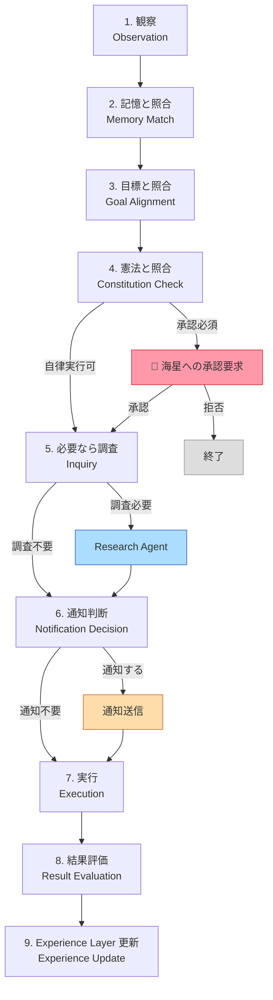

# Sigmaris Decision Flow

**目的:** Sigmarisの意思決定プロセスを詳細なステップとして定義する。各ステップの目的・入出力・使用レイヤーを明確にする。
**対象読者:** 実装者・設計者。
**更新方針:** 意思決定ロジックの変更があった場合に更新。

---

## 意思決定フロー概要



---

## ステップ詳細

---

### Step 1: 観察（Observation）

**目的:** 処理すべきトリガーを検出する。

**入力:**
- ユーザーのメッセージ
- Calendar イベント（発生・変更・削除）
- Research Agent からの新規情報
- Memory Validator からのアラート（矛盾・信頼度低下）
- Scheduler からの時刻トリガー

**出力:**
- 観察オブジェクト: `{type, content, source, timestamp, priority}`

**使用レイヤー:** Layer 7 (Orchestrator)、Layer 8 (Agents)

**Decision Log に保存:**
```json
{
  "step": "observation",
  "trigger_type": "user_message | calendar_event | research | alert | cron",
  "trigger_summary": "(内容の要約)",
  "source": "(発生元のサービス名)",
  "priority": "low | medium | high | urgent",
  "timestamp": "(ISO 8601)"
}
```

---

### Step 2: 記憶と照合（Memory Match）

**目的:** 観察した情報と既存記憶を照合し、関連する記憶を収集する。

**入力:**
- Step 1 の観察オブジェクト
- Memory Bus: Fact Memory（user_fact_items）
- Memory Bus: Identity（sigmaris_self_model）
- Memory Bus: Experience（sigmaris_self_discrepancies / 将来: sigmaris_experiences）
- Memory Bus: Narrative（sigmaris_narrative）

**出力:**
- 関連する記憶リスト（関連度スコア付き）
- 知識ギャップリスト（関連記憶が存在しない領域）
- 過去の類似ケースの参照

**使用レイヤー:** Memory Bus（横断レイヤー）、Layer 2 (Experience)

**Decision Log に保存:**
```json
{
  "step": "memory_match",
  "matched_memories": ["memory_id_1", "memory_id_2"],
  "knowledge_gaps": ["topic_A", "topic_B"],
  "similar_past_cases": ["case_id_1"]
}
```

**現在の実装:**
- ✅ Fact Memory 照合: `build_facts_context()` / `build_profile_context()`
- ✅ Identity 照合: `_build_self_model_context()`
- 💡 知識ギャップ検出 — 未実装
- 💡 類似ケース検索 — 未実装

---

### Step 3: 目標と照合（Goal Alignment）

**目的:** 観察した情報が海星の現在の目標・価値観とどのように関連するかを評価する。

**入力:**
- Step 2 の関連記憶リスト
- Layer 1 (Identity): `current_goals`
- Memory Bus: Goal Memory（将来実装予定）

**出力:**
- 目標関連度スコア（0.0–1.0）
- 目標達成に対する影響の評価（促進 / 中立 / 阻害）
- 優先度の更新（目標に関連する観察は優先度を上げる）

**使用レイヤー:** Layer 1 (Identity)、Layer 5 (Executive Controller)

**Decision Log に保存:**
```json
{
  "step": "goal_alignment",
  "goal_relevance_score": 0.75,
  "related_goals": ["goal_A"],
  "impact": "promotes | neutral | hinders",
  "priority_adjusted": true
}
```

**現在の実装:**
- 🔶 LLM が暗黙的に目標との照合を行っている
- 💡 明示的な Goal Alignment スコアリング — 未実装

---

### Step 4: 憲法と照合（Constitution Check）

**目的:** 実行しようとしている判断が Constitution（憲法）に違反しないかを確認する。承認必須操作かどうかを判定する。

**入力:**
- Step 3 の目標関連度・優先度
- 計画している行動の種別（`action_type`）
- Layer 0 (Constitution): Article 5（Boundaries）・Article 6（Autonomy）

**出力:**
- 実行可否: `allowed | requires_approval | forbidden`
- 承認必須フラグ（Constitution Article 6 参照）
- 違反の場合の理由

**使用レイヤー:** Layer 0 (Constitution)、Layer 5 (Executive Controller)

**承認必須判定ルール（Constitution Article 6 より）:**

| 操作 | 判定 |
|------|------|
| コード変更 | `requires_approval` |
| Git 操作 | `requires_approval` |
| DB 変更 | `requires_approval` |
| 外部投稿（X等） | `requires_approval` |
| Constitution 変更 | `requires_approval` |
| 人格構造変更 | `requires_approval` |
| 観察・分析 | `allowed` |
| Memory 整理 | `allowed` |
| 提案生成 | `allowed` |

**Decision Log に保存:**
```json
{
  "step": "constitution_check",
  "action_type": "(実行しようとした操作)",
  "result": "allowed | requires_approval | forbidden",
  "article_referenced": ["Article 5", "Article 6"],
  "approval_requested": false
}
```

**現在の実装:**
- 🔶 一部の承認制: X_ENABLED フラグ、明示的な approve 操作
- 💡 Constitution テーブルとの自動照合 — 未実装

---

### Step 5: 必要なら調査（Inquiry）

**目的:** 知識ギャップが存在し、かつ調査が有益な場合に、Research Agent を呼び出して情報を補完する。

**入力:**
- Step 2 の知識ギャップリスト
- Step 3 の目標関連度（低い場合は調査コストを正当化できない）
- コスト予算（RESEARCH_ENABLED フラグ・1日の API コスト上限）

**出力:**
- Research Agent からの調査結果
- 補完された知識（Memory Bus に書き込み）
- 調査不要の判断（知識ギャップが小さい・コストが高い場合）

**使用レイヤー:** Layer 3 (Curiosity Engine)、Layer 8 (Research Agent)

**調査を実行する条件:**
1. 知識ギャップが存在する
2. 目標関連度が 0.5 以上
3. 当日のリサーチコスト上限内（HIGH アイテム < 10件・Perspective < 5件）
4. RESEARCH_ENABLED = true

**Decision Log に保存:**
```json
{
  "step": "inquiry",
  "inquiry_performed": true,
  "inquiry_topic": "(調査テーマ)",
  "research_items_found": 3,
  "cost_estimate": "(token数)",
  "skip_reason": null
}
```

**現在の実装:**
- ✅ Research Agent 実行: `research_agent.py::run_research()`
- ✅ 1日上限チェック: `_db_count_today_high()` / `_db_count_today_perspectives()`
- 💡 知識ギャップ検出からの自動起動 — 未実装（現在は定時実行のみ）

---

### Step 6: 通知判断（Notification Decision）

**目的:** ユーザーへの通知・連絡が必要かどうかを判断する。過剰通知を避ける（設計原則 P7）。

**入力:**
- Step 3 の優先度・目標関連度
- 直近の通知履歴（今日すでに何件通知したか）
- 通知の緊急度（移動リマインダー：緊急 / 研究情報：低）
- `travel_notification_deliveries` テーブル（重複チェック）

**出力:**
- 通知を送る / 送らない の判断
- 通知種別（push / chat / morning_briefing に含める）
- 送らない場合: 次の定期ブリーフィングへのキュー追加（📋 Planned）

**通知を送る条件:**

| 条件 | 送る | 送らない |
|------|------|---------|
| 移動出発時刻が近い（< 60分） | ✅ | — |
| 同じ移動通知をすでに送信済み | — | ✅ |
| 研究情報（重要度 HIGH） | 翌朝ブリーフィングに含める | リアルタイムで送らない |
| System エラー（重大） | ✅ | — |

**使用レイヤー:** Layer 5 (Executive Controller)

**Decision Log に保存:**
```json
{
  "step": "notification_decision",
  "should_notify": true,
  "notification_type": "push | chat_message | briefing_queue",
  "skip_reason": null,
  "duplicate_check": "passed"
}
```

**現在の実装:**
- ✅ 重複チェック: `travel_notification_deliveries` テーブル
- ✅ 移動通知: `proactive/actions.py`
- 💡 通知キュー（次回ブリーフィングへの遅延） — 未実装

---

### Step 7: 実行（Execution）

**目的:** 承認済み・自律実行可の行動を実際に実行する。

**入力:**
- Step 4–6 の判断結果
- 必要な場合: 海星からの承認（async で待機）

**出力:**
- 実行結果（成功 / 失敗 / 部分成功）
- ユーザーへの応答（チャット）
- 副作用のリスト（変更されたリソース）

**使用レイヤー:** Layer 7 (Orchestrator)、Layer 8 (Agents)

**Decision Log に保存:**
```json
{
  "step": "execution",
  "actions_executed": ["action_type_1", "action_type_2"],
  "agents_called": ["schedule-agent"],
  "result": "success | partial | failure",
  "error": null,
  "audit_log_id": "(UUID)"
}
```

**現在の実装:**
- ✅ Orchestrator による実行: `orchestrator/service.py`
- ✅ Audit Log: `orchestrator/audit.py`

---

### Step 8: 結果評価（Result Evaluation）

**目的:** 実行結果を期待値と比較し、成功・失敗・要因を評価する。

**入力:**
- Step 7 の実行結果
- Step 3 で設定した期待値（目標関連度・想定結果）
- 海星からのフィードバック（明示的な反応・暗示的な行動変化）

**出力:**
- 評価スコア（期待を上回った / 期待通り / 期待を下回った）
- 失敗要因の分類（知識不足 / 実行エラー / 外部要因 / 誤った前提）
- Experience の種別（Success / Failure / Unresolved）

**使用レイヤー:** Layer 4 (Reflection)

**Decision Log に保存:**
```json
{
  "step": "result_evaluation",
  "outcome": "success | failure | unresolved",
  "expected_vs_actual": "(比較の要約)",
  "failure_category": "knowledge_gap | execution_error | external | wrong_assumption",
  "experience_type": "Success | Failure | Unresolved"
}
```

**現在の実装:**
- 🔶 自己矛盾の検出: `self_model.py::record_discrepancy()`
- 💡 包括的な結果評価ループ — 未実装

---

### Step 9: Experience Layer 更新（Experience Update）

**目的:** 評価結果を構造化して Experience Memory に保存する。次のサイクルで参照できる形にする。

**入力:**
- Step 8 の評価結果・Experience 種別
- 全 Decision Log（Steps 1–8 の記録）

**出力:**
- Memory Bus への Experience Memory 書き込み
- Layer 1 (Identity) への更新提案（重大な学習があった場合のみ）
- Layer 3 (Curiosity Engine) への探索テーマ提案（知識ギャップが判明した場合）

**使用レイヤー:** Layer 2 (Experience)、Memory Bus

**Decision Log に保存（完成版）:**
```json
{
  "decision_log_id": "(UUID)",
  "cycle_timestamp": "(ISO 8601)",
  "steps": {
    "observation": {...},
    "memory_match": {...},
    "goal_alignment": {...},
    "constitution_check": {...},
    "inquiry": {...},
    "notification_decision": {...},
    "execution": {...},
    "result_evaluation": {...},
    "experience_update": {
      "experience_stored": true,
      "experience_type": "Failure",
      "identity_update_proposed": false,
      "curiosity_topics_added": ["topic_X"]
    }
  }
}
```

**現在の実装:**
- ✅ Audit Log: `agent_invocation_audit_logs`（部分的に Decision Log の役割を担う）
- 💡 完全な Decision Log テーブル — 未実装
- 💡 Experience Memory の構造化保存 — 未実装

---

## Decision Log の保存設計

💡 **Planned** — 現在 `agent_invocation_audit_logs` が部分的に Decision Log として機能しているが、全ステップを網羅した Decision Log テーブルは未実装。

### 将来のテーブル設計

```sql
CREATE TABLE sigmaris_decision_logs (
    id UUID PRIMARY KEY DEFAULT gen_random_uuid(),
    created_at TIMESTAMPTZ DEFAULT NOW(),
    trigger_type TEXT NOT NULL,
    trigger_summary TEXT,
    constitution_result TEXT CHECK (constitution_result IN ('allowed', 'requires_approval', 'forbidden')),
    approval_required BOOLEAN DEFAULT FALSE,
    approval_granted BOOLEAN,
    execution_result TEXT CHECK (execution_result IN ('success', 'partial', 'failure', 'skipped')),
    experience_type TEXT CHECK (experience_type IN ('Success', 'Failure', 'Unresolved')),
    full_log JSONB -- Steps 1-9 の完全な記録
);
```

---

## Related Documents

- [cognitive_architecture.md](cognitive_architecture.md) — 各ステップが使用するレイヤーの詳細
- [constitution.md](constitution.md) — Step 4 の承認判断ルール（Article 5・6）
- [lifecycle.md](lifecycle.md) — このフローが属するライフサイクルフェーズ
- [memory_model.md](memory_model.md) — Step 2・9 で読み書きする Memory の定義
- [agent_protocol.md](agent_protocol.md) — Step 5・7 での Agent 呼び出し方式
