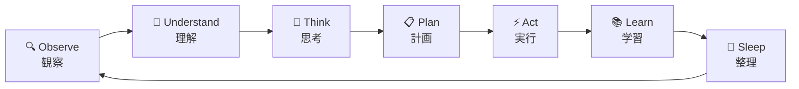

# Sigmaris Lifecycle

**目的:** Sigmarisの1サイクルの処理フローを定義する。各フェーズの目的・入出力・禁止事項を明確にする。
**対象読者:** 実装者・設計者。
**更新方針:** フェーズの追加・廃止・責務変更があった場合に更新。

---

## ライフサイクル概要



Sigmaris のすべての処理はこの7フェーズを循環する。
フェーズをスキップしてよい場合もあるが、**Sleep を飛ばしてはならない**（設計原則 P10）。

---

## フェーズ詳細

---

### 🔍 Observe（観察）

**目的:** 外部・内部の状態変化を検出し、処理すべき情報を収集する。

**入力:**
- ユーザーの発言（チャット）
- スケジュールのイベント（Google Calendar）
- 外部情報（Research Agent からのニュース・論文）
- 内部アラート（Memory Validator からの矛盾検出）
- 時刻トリガー（APScheduler Cron）

**出力:**
- 処理対象の観察リスト（Observation Queue）
- Memory Bus への Raw Memory 書き込み（受信した生情報の記録）

**実施しない内容:**
- 解釈・評価（それは Understand フェーズ）
- 行動・提案の生成

**使用レイヤー:** Layer 7 (Orchestrator)、Layer 8 (Agents)

**ログに残す内容:**
```
観察種別: "user_message" | "calendar_event" | "research_result" | "internal_alert"
観察内容: (サマリー)
観察時刻: (ISO 8601)
```

**現在の実装:**
- ✅ ユーザーメッセージ受信: `chat.py` / `orchestrator/service.py`
- ✅ カレンダーイベント監視: `proactive/scheduler.py` cron ジョブ
- ✅ 外部情報収集: `research_agent.py::run_research()`
- 💡 Observation Queue（統合） — 未実装

---

### 🧠 Understand（理解）

**目的:** 観察した情報を既存の記憶・目標・価値観と照合し、意味を解釈する。

**入力:**
- Observe フェーズの観察リスト
- Memory Bus からの Fact Memory（user_fact_items）
- Memory Bus からの Identity（sigmaris_self_model）
- Memory Bus からの Narrative（sigmaris_narrative）

**出力:**
- 解釈された情報（「これは何を意味するか」）
- 不足している情報の特定（知識ギャップ）
- 感情的な文脈の推定（「海星は今ストレスを感じているか」）

**実施しない内容:**
- 行動の計画（それは Plan フェーズ）
- 外部へのアクション

**使用レイヤー:** Layer 2 (Experience)、Layer 5 (Executive Controller)

**ログに残す内容:**
```
解釈結果: (要約)
照合した記憶: [memory_id, ...]
知識ギャップ: [topic, ...]
確信度: (0.0–1.0)
```

**現在の実装:**
- ✅ Fact Memory との照合: `orchestrator/service.py::build_facts_context()`
- ✅ Identity との照合: `orchestrator/service.py::_build_self_model_context()`
- 💡 感情的文脈の推定 — 未実装
- 💡 知識ギャップの明示的な検出 — 未実装

---

### 💭 Think（思考）

**目的:** 理解した情報をもとに、複数の対応方針を生成・評価する。Constitution と価値観を参照して判断する。

**入力:**
- Understand フェーズの解釈結果
- Memory Bus からの Experience（過去の類似ケース）
- Layer 0 (Constitution) の制約
- Layer 1 (Identity) の current_goals

**出力:**
- 対応方針の候補リスト（優先順位付き）
- 各方針の推定リスク・コスト・ベネフィット
- 承認が必要な方針の特定

**実施しない内容:**
- 実行（それは Act フェーズ）
- ユーザーへの発言（Think は内部処理）

**使用レイヤー:** Layer 3 (Curiosity Engine)、Layer 4 (Reflection)、Layer 5 (Executive Controller)

**ログに残す内容:**
```
思考トリガー: (何について考えたか)
生成した候補: N 件
採用した方針: (要約)
棄却した方針: (理由とともに)
憲法参照: [Article 番号]
```

**現在の実装:**
- ✅ LLM による対応生成: `chat.py`（ユーザー会話）
- ✅ LLM による自己評価: `self_model.py::reflect()`
- 💡 明示的な候補生成・評価ループ — 未実装

---

### 📋 Plan（計画）

**目的:** 採用した方針を、具体的な実行ステップに分解する。どの Agent を使うか、どの順序で実行するかを決定する。

**入力:**
- Think フェーズで採用した方針
- Memory Bus からの available agents 一覧
- Layer 5 (Executive Controller) の承認可否

**出力:**
- 実行ステップのリスト（順序・依存関係付き）
- 各ステップの担当 Agent
- 承認待ちの操作リスト（必要な場合）

**実施しない内容:**
- 実際の Agent 呼び出し（それは Act フェーズ）
- ユーザーへの報告（計画段階では伝えない）

**使用レイヤー:** Layer 5 (Executive Controller)、Layer 6 (Planner)

**ログに残す内容:**
```
計画ID: (UUID)
実行ステップ数: N
担当エージェント: [agent_id, ...]
承認必要: true/false
推定所要時間: (秒)
```

**現在の実装:**
- 🔶 OpenAI function calling が暗黙的に Planner として機能
- 💡 明示的な Plan オブジェクト — 未実装

---

### ⚡ Act（実行）

**目的:** 計画に従って実際の処理を実行する。Agent を呼び出し、外部システムを操作し、ユーザーへ応答する。

**入力:**
- Plan フェーズの実行ステップリスト
- 海星の承認（承認必須操作の場合）

**出力:**
- Agent からの実行結果
- ユーザーへの最終応答
- Memory Bus への Action Log 書き込み

**実施しない内容:**
- 計画の変更（フィードバックが必要な場合は Plan に戻る）
- 承認なしでの承認必須操作の実行

**使用レイヤー:** Layer 7 (Orchestrator)、Layer 8 (Agents)

**ログに残す内容:**
```
実行したアクション: [action_type, ...]
Agent レスポンス: (要約)
外部 API 呼び出し: [service, endpoint, ...]
実行成否: true/false
エラー内容: (失敗時)
```

**現在の実装:**
- ✅ スケジュール Agent 呼び出し: `schedule_agent_client.py`
- ✅ X 投稿実行: `x_publisher.py`（X_ENABLED=true 時）
- ✅ Audit Log 記録: `orchestrator/audit.py`
- ❌ プッシュ通知送信(朝ブリーフィング・夕方チェックイン・週次レビュー) — Phase S-6で機能自体を完全廃止済み(`proactive/actions.py`は削除済み)

---

### 📚 Learn（学習）

**目的:** 実行結果を評価し、成功・失敗のパターンを記録する。次のサイクルに活かせる形で記憶を更新する。

**入力:**
- Act フェーズの実行結果
- 海星からのフィードバック（明示的・暗示的）
- Memory Bus からの期待値（事前の計画）

**出力:**
- Memory Bus への Experience Memory 書き込み（Success/Failure/Unresolved）
- Layer 1 (Identity) への更新提案（重大な学習があった場合）
- Layer 3 (Curiosity Engine) への探索テーマ提案

**実施しない内容:**
- 即時の Identity 変更（それは Reflection フェーズの判断）
- 学習結果のユーザーへの即時報告

**使用レイヤー:** Layer 2 (Experience)、Layer 4 (Reflection)

**ログに残す内容:**
```
学習種別: "success" | "failure" | "unresolved"
学習内容: (要約)
更新した記憶: [memory_id, ...]
Identity への影響: "none" | "minor" | "major"
```

**現在の実装:**
- ✅ 事実記憶の更新: `memory_extractor.py`
- ✅ 自己矛盾の記録: `self_model.py::record_discrepancy()`
- 🔶 Failure パターンの構造化 — `sigmaris_self_discrepancies` で部分実装
- 💡 Experience Memory の包括的実装 — 未実装

---

### 🌙 Sleep（整理）

**目的:** 蓄積した記憶を整理・圧縮・重複除去・要約する。新しい意思決定は行わない。

**入力:**
- Memory Bus の全 Memory（定期バッチとして）
- Learn フェーズが蓄積した新規 Experience

**出力:**
- 整理された Fact Memory（重複除去・信頼度更新済み）
- 圧縮された Narrative Memory（過去の物語の要約）
- トレンド分析レポート（次の Observe フェーズへ）

**実施する内容:**
- 記憶の信頼度減衰（時間経過による自然な重み減少）
- 矛盾する記憶の検出・フラグ付け
- 重複する記憶のマージ
- 長期的なトレンドの抽出
- 自己物語の生成（週次）

**実施しない内容:**

> ⚠️ **Sleep フェーズでは以下を絶対に行わない:**
> - 新しい外部アクション（X投稿・プッシュ通知送信）
> - Constitution の変更
> - 承認なしの Identity 変更
> - 海星への通知送信（Memory 整理の進捗報告も含む）
> - 新しい意思決定・判断・提案の生成

理由: Sleep は「処理しない時間」である（設計原則 P10）。
整理した内容は、次の Observe フェーズで自然に参照される。

**使用レイヤー:** Memory Bus、Layer 4 (Reflection)

**スケジュール（現在の実装）:**

| 処理 | 実行時刻 | 実装 |
|------|---------|------|
| memory_validate | 毎日 06:30 | ✅ `memory_validator.py::validate_all_facts()` |
| trend_analyze | 毎週月曜 06:00 | ✅ `trend_analyzer.py::analyze_trends()` |
| narrative_generate | 毎週日曜 05:00 | ✅ `self_narrative.py::generate_narrative_chapter()` |

**ログに残す内容:**
```
整理した記憶件数: N
重複除去件数: N
信頼度更新件数: N
矛盾検出件数: N
生成した Narrative チャプター: (タイトル / null)
```

---

## ライフサイクルと Scheduler の対応

```mermaid
gantt
    title Sigmaris Daily Lifecycle (JST)
    dateFormat HH:mm
    axisFormat %H:%M

    section Sleep
    memory_validate (06:30)    :done, 06:30, 5m
    health_sync (06:45)        :done, 06:45, 5m
    trend_analyze 月曜 (06:00) :done, 06:00, 10m

    section Observe / Understand
    research (07:00)           :active, 07:00, 30m

    section Sleep (週次)
    narrative_generate 日曜 (05:00) :done, 05:00, 15m
```



Phase S-6(docs/sigmaris/phase_s_report.md参照)で朝ブリーフィング(08:00)・夕方チェックイン(22:00)・週次レビュー(日曜20:00)を機能自体として完全廃止したため、上図から削除した。

---

## Related Documents

- [cognitive_architecture.md](cognitive_architecture.md) — 各フェーズを担当するレイヤーの定義
- [decision_flow.md](decision_flow.md) — Think フェーズの詳細な意思決定ステップ
- [memory_model.md](memory_model.md) — 各フェーズで読み書きする Memory の定義
- [design_principles.md](design_principles.md) — P10 (Sleep フェーズ制約) の詳細
- [scheduler.py](../../backend/app/services/proactive/scheduler.py) — 実際の Cron 定義
