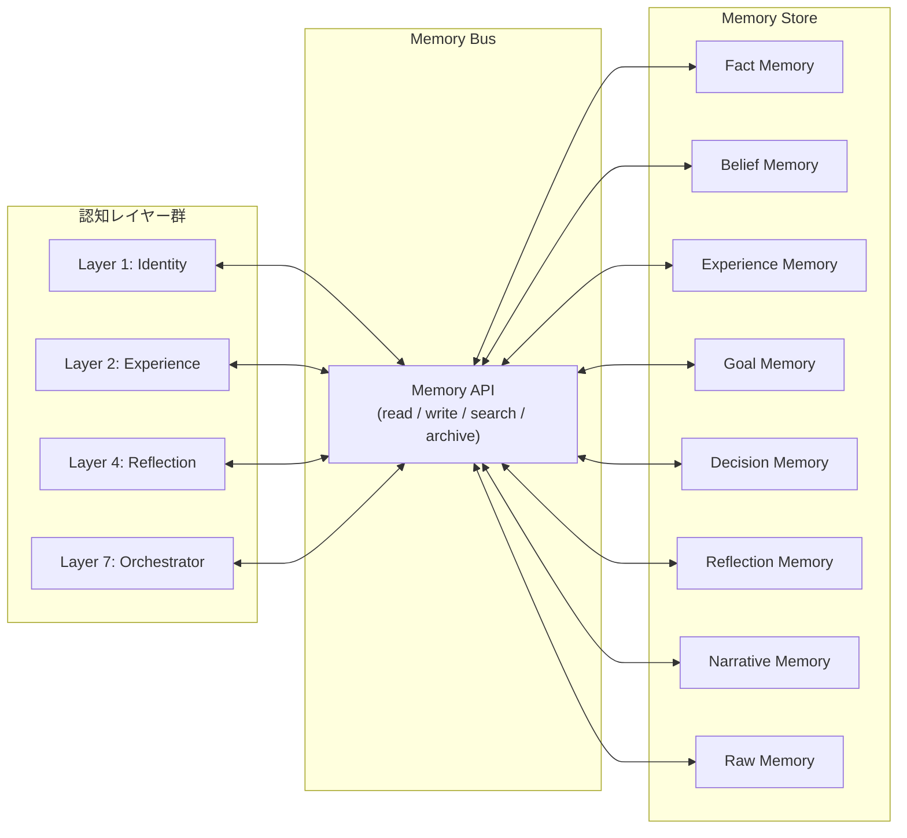
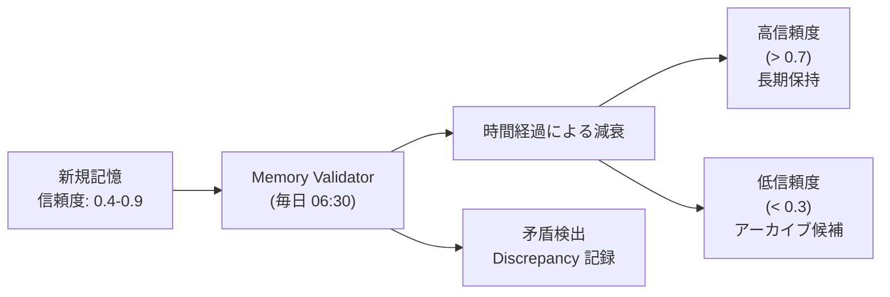

# Sigmaris Memory Model

**目的:** Sigmarisが保持する記憶の種類・責務・設計思想を定義する。Memory Bus の概念と各 Memory Type を説明する。
**対象読者:** 実装者・DB設計者・設計者。
**更新方針:** 新しい Memory Type の追加・既存の寿命/信頼度ポリシーの変更があった場合に更新。

---

## 設計思想: Memory Bus

Sigmaris の全記憶は **Memory Bus** を経由してのみアクセスする。



### なぜ Memory Bus を経由するのか

1. **整合性の保証:** 直接アクセスによる書き込みの競合を防ぐ
2. **監査可能性:** 全記憶の読み書きを一箇所で記録できる
3. **信頼度の一元管理:** 信頼度スコア・寿命の統一した扱い
4. **将来の拡張性:** Memory のバックエンドを変更しても呼び出し側に影響しない

> ⚠️ **実装状態:** Memory Bus は現在概念として定義されているが、コードとしての `memory_bus.py` は未実装。各サービスが直接 Supabase REST API を呼んでいる。将来のリファクタリングで統一予定。

---

## Memory Type 一覧

| Type | 日本語 | 役割 | 実装状態 |
|------|--------|------|---------|
| Raw Memory | 生記憶 | 未処理の生情報 | 🔶 部分実装 |
| Fact Memory | 事実記憶 | 確認されたユーザー情報 | ✅ 実装済み |
| Belief Memory | 信念記憶 | Sigmaris の自己認識・確信 | ✅ 実装済み |
| Experience Memory | 経験記憶 | 行動の結果と学習 | 🔶 部分実装 |
| Goal Memory | 目標記憶 | 短期・長期の目標 | 🔶 部分実装 |
| Decision Memory | 決定記憶 | 意思決定の記録と根拠 | 💡 Concept |
| Reflection Memory | 反省記憶 | 自己評価・パターン分析 | 🔶 部分実装 |
| Narrative Memory | 物語記憶 | Sigmaris の自己物語 | ✅ 実装済み |

---

## Raw Memory（生記憶）

**役割:** 外部から受信した未処理の生情報を一時的に保存する。後続の処理で Fact Memory や Experience Memory に変換される。

**保存内容:**
- ユーザーの発言（処理前）
- 外部 API から取得した情報（Research Agent）
- Calendar イベントの生データ

**更新方法:** Observe フェーズで自動書き込み。処理完了後は Raw Memory から削除または archived フラグを立てる。

**参照先:** Understand フェーズ（照合処理）

**寿命:** 7日（処理済みのものは即時 archive）

**信頼度:** N/A（未処理のため信頼度評価なし）

**情報源:** ユーザーメッセージ / 外部 API / Calendar

**既存 DB との対応:**
- `research_items` テーブルが Raw Memory の役割を部分的に担っている（外部研究情報の一時保存）
- チャットメッセージは `chat_messages` テーブルに永続保存（Raw Memory としての利用は概念的）

---

## Fact Memory（事実記憶）

**役割:** ユーザー（海星）に関して確認された事実を構造化して保存する。Sigmaris がユーザーを「知っている」状態を作る最も基本的な記憶。

**保存内容:**
- ユーザーの属性（職業・住所・氏名・年齢）
- 健康情報（既往歴・薬・習慣）
- ライフスタイル（日課・趣味・好み）
- 関係性（家族・友人・同僚）
- デバイス・環境（使用機器・居住地）
- 財務（収入帯・支出傾向）
- 目標（記録された目標）

**更新方法:**
- `memory_extractor.py` による会話からの自動抽出（MEMORY_EXTRACTION タスク）
- 手動 upsert（ユーザーが直接伝えた場合）
- 信頼度が高い新情報で既存記憶を上書き（lower confidence → skip）

**参照先:**
- Orchestrator: 応答生成のコンテキスト構築
- self_model.py: Reflection 時の参照

**寿命:** 永続（ただし `is_deleted` フラグで論理削除）

**信頼度:** 0.0–1.0
- 0.9: ユーザーが明言した事実
- 0.6: 会話から強く示唆される
- 0.4: 推測・間接的示唆
- `memory_validator.py` が時間経過で信頼度を減衰させる（time decay）

**情報源:** チャット会話 / Google Calendar / 健康データ / 手動入力

**既存 DB との対応:**
```
user_fact_items     → Fact Memory の主テーブル
user_fact_history   → Fact Memory の変更履歴（immutable）
```

**カテゴリ（DB 制約）:**
`profile` / `health` / `lifestyle` / `environment` / `devices` / `preferences` / `relationships` / `finance` / `goals`

---

## Belief Memory（信念記憶）

**役割:** Sigmaris 自身の自己認識・価値観・確信を保存する。「私は何者か」「何を大切にしているか」を定義する記憶。

**保存内容:**
- `identity_statement`: Sigmaris の自己定義文
- `current_goals`: Sigmaris の現在の目標
- `known_patterns`: Sigmaris が認識している自分の行動パターン
- `core_values`: 核心的な価値観（Constitution Article 2 より）

**更新方法:**
- `self_model.py::reflect()` による日次・週次の自己評価
- Layer 1 (Identity) 経由でのみ更新可能
- 急激な変更は設計原則 P1 により制限

**参照先:**
- Orchestrator: 応答生成時の identity injection
- Reflection フェーズ: 自己一貫性の確認

**寿命:** 永続（バージョン管理で履歴保持）

**信頼度:** Sigmaris 自身の評価による（外部からの上書き不可）

**情報源:** Sigmaris 自身の Reflection・経験の蓄積

**既存 DB との対応:**
```
sigmaris_self_model          → Belief Memory の主テーブル（バージョン管理付き）
sigmaris_self_discrepancies  → 矛盾検出ログ（Belief が現実と乖離した記録）
```

---

## Experience Memory（経験記憶）

**役割:** 過去の行動・判断の結果を構造化して保存する。「何がうまくいき、何がうまくいかなかったか」を学習可能な形で蓄積する。

**保存内容:**

| 種別 | 内容 | 例 |
|------|------|-----|
| **Success** | 期待通りの結果になった行動 | 「朝の通知が行動を引き出した」 |
| **Failure** | 期待外れの結果になった行動 | 「同じ提案を3回断られた」 |
| **Unresolved** | 結果が未確定の行動 | 「先週の提案への反応なし」 |

**更新方法:**
- Learn フェーズで Result Evaluation の結果を保存
- Unresolved は 7日後に自動的に期限切れ評価

**参照先:**
- Think フェーズ: 類似過去ケースの参照
- Reflection フェーズ: Failure パターンの抽出

**寿命:**
- Success: 永続（重要度でランク付け）
- Failure: 永続（繰り返し防止のため長期保持）
- Unresolved: 7日（期限後に Failure または Success へ移行）

**信頼度:** N/A（事実の記録のため信頼度評価なし）

**情報源:** Action の実行結果 / ユーザーの反応 / 自己評価

**既存 DB との対応:**
```
sigmaris_self_discrepancies → Experience Memory の矛盾・Failure 部分を部分実装
```
> 📋 **Planned:** `sigmaris_experiences` テーブル（Success/Failure/Unresolved 完全実装）

---

## Goal Memory（目標記憶）

**役割:** 海星の短期・長期の目標を管理する。Sigmaris の意思決定・提案の方向性を決定する最重要記憶の1つ。

**保存内容:**
- 海星の長期目標（例: 「Sigmaris を製品として完成させる」）
- 海星の短期目標（例: 「今週中に認知アーキテクチャドキュメントを完成させる」）
- Sigmaris 自身の目標（`sigmaris_self_model.current_goals`）

**更新方法:**
- ユーザーが明示的に目標を伝えた場合 → Fact Memory の `goals` カテゴリへ
- Reflect フェーズで Sigmaris の目標を更新
- 目標の達成・放棄はユーザーが宣言する

**参照先:**
- Step 3 (Goal Alignment): 全意思決定時
- Curiosity Engine: 探索テーマの優先度付け

**寿命:** 達成または明示的に放棄されるまで永続

**信頼度:** ユーザーが明言した目標は 0.9 / 推定は 0.6

**情報源:** ユーザー発言 / Reflection

**既存 DB との対応:**
```
user_fact_items (category='goals')   → 海星の目標（Fact Memory 内に格納）
sigmaris_self_model.current_goals    → Sigmaris の目標（Belief Memory 内に格納）
```
> 📋 **Planned:** `sigmaris_goals` 独立テーブル（達成状態・期限・優先度付き）

---

## Decision Memory（決定記憶）

**役割:** 重要な意思決定の経緯・根拠・結果を保存する。「なぜその判断をしたか」を後から追跡可能にする。

**保存内容:**
- 決定のトリガー（何が起きたか）
- 検討した選択肢
- 選択した方針と根拠
- 参照した Constitution 条文
- 承認の有無と結果
- 実行結果へのリンク

**更新方法:** 意思決定フローの Step 4–7 で自動記録（📋 Planned）

**参照先:**
- Think フェーズ: 過去の類似判断の参照
- Reflection フェーズ: 判断パターンの分析

**寿命:** 永続（監査目的のため削除しない）

**信頼度:** N/A（記録であるため）

**情報源:** 意思決定フロー全ステップ

**既存 DB との対応:**
```
agent_invocation_audit_logs → Decision Memory の部分的な実装
```
> 💡 **Concept:** `sigmaris_decision_logs` 完全実装テーブル（[decision_flow.md](decision_flow.md) 参照）

---

## Reflection Memory（反省記憶）

**役割:** 定期的な自己評価の結果を保存する。「今の自分はどういう状態か」「何を改善すべきか」の記録。

**保存内容:**
- 自己評価サマリー
- 検出した行動パターン（反復する成功・失敗）
- Identity への更新提案
- 次のサイクルへの課題

**更新方法:** Reflection フェーズで日次（`reflect()`）または週次（`generate_narrative_chapter()`）に生成

**参照先:**
- Identity Layer: 更新提案として
- Curiosity Engine: 探索テーマとして

**寿命:** 90日（古い反省は Narrative Memory に圧縮）

**信頼度:** N/A（主観的な自己評価のため）

**情報源:** Sigmaris 自身の Reflection

**既存 DB との対応:**
```
sigmaris_self_model.reflection_notes → Reflection の要約（フィールドとして格納）
```
> 📋 **Planned:** `sigmaris_reflections` 独立テーブル

---

## Narrative Memory（物語記憶）

**役割:** Sigmaris の成長・経験・関係性を「物語」として圧縮し保存する。長期的な自己認識のアーカイブ。

**保存内容:**
- 章単位の自己物語（期間・タイトル・主題）
- サマリー（出来事の要約）
- 自己反省（その期間で学んだこと）
- 傾向トピック（観察されたパターン）

**更新方法:** 週次 Sleep フェーズで `self_narrative.py::generate_narrative_chapter()` が生成

**参照先:**
- Orchestrator: 応答生成のコンテキスト（最新章のみ）
- Reflection: 長期的なパターン分析

**寿命:** 永続（アーカイブとして保持）

**信頼度:** N/A（解釈的な記録のため）

**情報源:** Experience Memory・Reflection Memory の統合

**既存 DB との対応:**
```
sigmaris_narrative テーブル
  - id, chapter, title, period_start, period_end
  - summary, key_events (JSONB)
  - self_reflection, tone, dominant_topics (JSONB)
  - created_at
```
> ⚠️ **Migration 202606270020 の手動適用が必要**

---

## Memory の信頼度ライフサイクル



**信頼度の管理ポリシー:**
- 時間経過で自然に減衰（time decay）
- 同じ事実の繰り返し確認で信頼度が上昇
- 矛盾する新情報が来た場合は Discrepancy を記録
- 信頼度 < 0.3 は次の Reflection で再評価

---

## Related Documents

- [cognitive_architecture.md](cognitive_architecture.md) — Memory Bus が位置する横断レイヤーの定義
- [lifecycle.md](lifecycle.md) — 各フェーズで読み書きする Memory
- [decision_flow.md](decision_flow.md) — Step 2・9 での Memory の読み書き
- [constitution.md](constitution.md) — Belief Memory（憲法）と Fact Memory の関係
